# Omagotchi

A tiny 8-bit pixel art virtual pet that lives in your Waybar. Raise it, feed it, protect it from snakes, and tend a zen garden — all from your status bar.

Built for [Omarchy](https://omarchy.org/) (Arch Linux + Hyprland + Waybar).

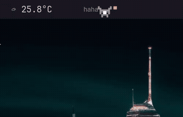 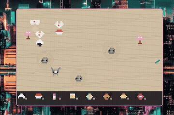

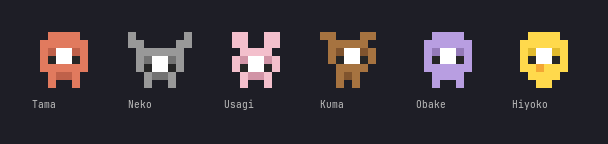

## Why?

We spend hours staring at terminals. Waiting for builds to compile. Waiting for `cargo build` to finish its 347th dependency. Waiting for Claude Code to think. Waiting for Codex to spin up. Waiting for CI to go green. Waiting for Docker to pull yet another layer.

There's a lot of waiting in this job.

And in those gaps — those 10-second, 30-second, 2-minute pockets of dead air — your eyes just drift to the status bar anyway. The clock. The battery. The wifi icon. Nothing.

So I put a little creature there instead.

It started as a joke. A tiny tamagotchi on my Waybar, something to click while a long test suite ran. But then I gave it emotions. Then a zen garden. Then birds carrying food. Then snakes that attack if you're not paying attention. Then mythic-tier dragon fruit with a 1-in-158 drop rate.

Now I catch myself glancing up between keystrokes to check if my Neko is still sleeping. I open the garden during compile times and tap cranes for onigiri. I panic-click snakes mid-code-review. I've accidentally bonded with a mass of pixels that lives in 33x22 CSS background space.

It's an ice breaker. A fidget spinner for your status bar. A tiny dopamine hit between the real dopamine hits of shipping code. It won't make you more productive — but it'll make the waiting feel a little less like waiting.

And honestly? After 12 hours of debugging a race condition, sometimes you just need a little ghost friend with purple ears going `zZzZzZ` to remind you that not everything has to be serious.

## Features

- **6 selectable characters** — Tama, Neko, Usagi, Kuma, Obake, Hiyoko
- **Egg hatching** — click 3 times to hatch your pet
- **Life system** — measured in minutes, decays in real time
- **Animated emotions** — walking, sleeping, happy, crying, scared, sick, and more
- **Zen garden** — interactive popup with birds, snakes, sakura trees, and rare food
- **Hover detection** — move your cursor over the pet and watch it react
- **Cairo-rendered sprites** — all pixel art generated programmatically as PNGs

## Installation

### Requirements

- [Omarchy](https://omarchy.org/) or any Arch Linux + Waybar setup
- Python 3
- `python-cairo` (pycairo)
- `python-gobject` + `gtk3`
- `hyprland` (for cursor hover detection)

```bash
sudo pacman -S python-cairo python-gobject gtk3
```

### Backup First

The installer modifies your waybar config. Back up before you install:

```bash
cp -r ~/.config/waybar ~/.config/waybar.bak
```

To restore if anything goes wrong:

```bash
rm -rf ~/.config/waybar
cp -r ~/.config/waybar.bak ~/.config/waybar
omarchy-restart-waybar  # or: killall waybar && waybar &
```

### Quick Install

```bash
git clone https://github.com/bramvera/omagotchi.git
cd omagotchi
./install.sh
```

The installer will:
1. Copy scripts to `~/.config/waybar/scripts/`
2. Generate all 86 sprite PNGs to `~/.local/state/omagotchi/sprites/`
3. Add the CSS import to your waybar `style.css`
4. Print the waybar module config you need to add
5. Optionally restart waybar

### Manual Install

1. Copy scripts:
```bash
cp scripts/omagotchi*.py ~/.config/waybar/scripts/
cp scripts/omagotchi-hover.sh ~/.config/waybar/scripts/
chmod +x ~/.config/waybar/scripts/omagotchi-hover.sh
```

2. Generate sprites:
```bash
python3 ~/.config/waybar/scripts/omagotchi.py --generate
```

3. Add CSS import to `~/.config/waybar/style.css`:
```css
@import "/home/YOUR_USERNAME/.local/state/omagotchi/sprites/omagotchi.css";
```

4. Add module to `~/.config/waybar/config.jsonc`:
```jsonc
// Add to modules-center (or modules-left/right):
"modules-center": ["clock", "custom/omagotchi"],

// Module definition:
"custom/omagotchi": {
  "exec": "python3 ~/.config/waybar/scripts/omagotchi.py",
  "return-type": "json",
  "interval": 1,
  "on-click": "python3 ~/.config/waybar/scripts/omagotchi.py --pet",
  "on-click-middle": "python3 ~/.config/waybar/scripts/omagotchi-select.py",
  "on-click-right": "python3 ~/.config/waybar/scripts/omagotchi-garden.py",
  "on-scroll-up": "python3 ~/.config/waybar/scripts/omagotchi.py --hover",
  "on-scroll-down": "python3 ~/.config/waybar/scripts/omagotchi.py --hover",
  "format": "{}",
  "tooltip": true
}
```

5. Restart waybar:
```bash
omarchy-restart-waybar  # on Omarchy
# or: killall waybar && waybar &
```

### Uninstall

```bash
./uninstall.sh
```

## Controls

| Action | What it does |
|--------|-------------|
| **Left-click** | Pet your creature (+1 min life), hatch egg, or rebirth if dead |
| **Middle-click** | Open character selection popup |
| **Right-click** | Open the Zen Garden |
| **Scroll up/down** | Trigger hover reaction (scared -> lol -> happy) |
| **Hover cursor** | Auto-detected! Pet reacts when cursor is near |

## Characters

Choose from 6 unique pixel art pets. Each has a distinct personality through color and shape.


| Character | Description |
|-----------|-------------|
| **Tama** | Classic tamagotchi — warm terracotta body |
| **Neko** | Cat with pointy ears — cool grey fur |
| **Usagi** | Bunny with tall ears — soft pink |
| **Kuma** | Bear with round ears — earthy brown |
| **Obake** | Ghost — ethereal purple |
| **Hiyoko** | Chick with an orange beak — bright yellow |

Selecting a new character resets to egg state.

## Emotions & States

Your pet cycles through moods based on interactions and time.

| State | Sprite | Trigger |
|-------|--------|---------|
| **Egg** | 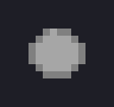 | Starting state — click 3x to hatch |
| **Walk** |  | Default awake state, pet strolls back and forth |
| **Sleep** | 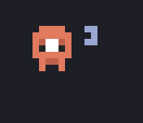 | Dominant state — animated `z -> zZ -> zZz` text grows with duration |
| **Happy** | 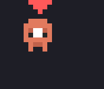 | Just petted — pulsing heart above head |
| **Cry** | 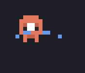 | Hungry (no food for 12+ hours) — animated tears stream left and right |
| **Sick** | 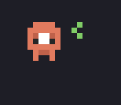 | Snake bite in garden — green swirl, lasts 30 seconds |
| **Miss** | 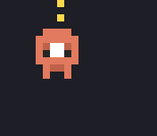 | Haven't visited in 5+ minutes — brief `!` flash |
| **Scared** | 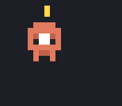 | Cursor detected nearby — dashes to far edge |
| **Lol** | 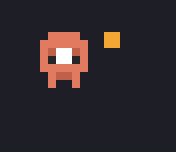 | After scared, pet starts laughing |
| **Dead** |  | Life reached 0 — click to rebirth as egg |

### Mood Priority

The pet evaluates states in this order (first match wins):
1. Egg / Dead
2. Happy (just petted, 5 seconds)
3. Sick (snake bite, 30 seconds)
4. Hover reaction (scared -> lol -> happy)
5. Miss (>5 min since last pet, brief flash)
6. Forced awake (after petting, walk)
7. Sleep/walk timer cycle
8. Hungry cry (during walk, if >12h without food)

## Life System

Life is measured in **minutes** and decays in real time.

| Mechanic | Value |
|----------|-------|
| Starting life | 1440 min (24 hours) |
| Decay rate | 1 min per 60 real seconds |
| Click (pet) | +1 min |
| Food (garden) | +3 to +35 min depending on rarity |
| Snake bite | -30 min |

When life reaches 0, the pet dies. Click to rebirth as a new egg.

### Sleep Behavior

Sleep is the **dominant state**. Your pet sleeps for 2-10 minutes at a time, briefly wakes to walk for 5-12 seconds, then goes back to sleep. Clicking wakes it up for a short happy + walk period before it drifts off again.

The sleep text animates progressively:
- Under 30s: `z`
- Under 1 min: `z` -> `zZ` (cycling)
- Under 2 min: `z` -> `zZ` -> `zZz`
- Under 5 min: up to `zZzZ`
- Under 10 min: up to `zZzZz`
- Over 10 min: up to `zZzZzZ`

## Zen Garden

Right-click the pet to open an interactive zen garden popup.

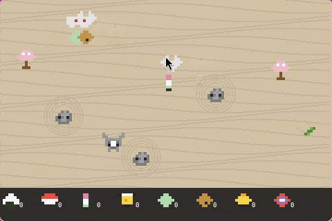

### The Garden Features

- **Raked sand** with wavy patterns
- **Rocks** surrounded by concentric zen circles
- **Sakura trees** as decoration
- **Your pet** walks around the garden — click to pet (+1 min)
- **Flying cranes** carry food across the sky — click to catch!
- **Snakes** slither toward your pet — tap to kill before they bite!

### Catching Food

Japanese cranes fly across the garden carrying food. Click a bird to catch its food and add it to your inventory (shown at the bottom panel). Click your pet to feed it the oldest food first.

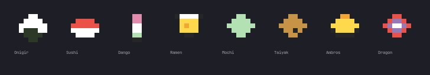

| Food | Life | Rarity | Drop Weight |
|------|------|--------|-------------|
| Onigiri | +3 min | Common | 30 |
| Dango | +4 min | Common | 25 |
| Mochi | +3 min | Common | 25 |
| Taiyaki | +5 min | Uncommon | 20 |
| Sushi | +6 min | Uncommon | 20 |
| Ramen | +8 min | Rare | 15 |
| Ambrosia | +20 min | Mythic | 2 |
| Dragon Fruit | +35 min | Mythic | 1 |

Mythic foods are extremely rare. The **Dragon Fruit** has a 1-in-158 chance per bird!

### Killing Snakes

Snakes spawn every 10-20 seconds and slither toward your pet. If a snake reaches the pet:
- **-30 min life** lost
- Pet becomes **sick** for 30 seconds (visible in both garden and waybar)

Click directly on the snake to kill it before it reaches your pet.

## File Structure

```
~/.config/waybar/scripts/
  omagotchi.py           # Main waybar module (display, pet, hover)
  omagotchi-garden.py    # Zen garden popup (GTK3)
  omagotchi-select.py    # Character selection popup (GTK3)
  omagotchi-hover.sh     # Hover proxy for scroll events

~/.local/state/omagotchi/
  state.json             # Pet state (life, mood, character, etc.)
  hover.json             # Hover detection state
  garden.json            # Food inventory
  sprites/
    omagotchi.css        # Generated CSS for waybar sprite display
    *.png                # 86 generated sprite images
```

## Performance

Omagotchi is lightweight. Benchmarked on a live Omarchy system by restarting waybar with and without the module, then measuring after stabilization (~30s):

| | RSS Memory | CPU | System RAM |
|---|---|---|---|
| Waybar **without** omagotchi | 77.7 MB | 0.7% | 0.2% |
| Waybar **with** omagotchi | 82.6 MB | 0.9% | 0.2% |
| **Overhead** | **+4.9 MB** | **+0.2%** | **0.0%** |

The main script (`omagotchi.py`) runs once per second via waybar's `interval: 1`, reads/writes a small JSON state file, and exits. No persistent daemon. The garden and selection popups only run when opened and close cleanly.

*Measured on Arch Linux, Ryzen 7, 32GB RAM, Hyprland + Waybar. Your numbers may vary slightly.*

## How It Works

1. **Waybar** calls `omagotchi.py` every second to get display JSON
2. The script outputs `{"text": "...", "tooltip": "...", "class": ["sprite-name", "p3"]}`
3. CSS classes set the `background-image` to the correct sprite PNG
4. Position classes (`p0` through `p6`) animate horizontal walking via `background-position`
5. All sprites are rendered with **PyCairo** from 8x7 pixel art definitions scaled 3x
6. Garden and selection popups use **GTK3** with Cairo drawing
7. Cursor hover detection uses `hyprctl cursorpos` + `hyprctl layers` for HiDPI-safe logical coordinates
8. File locking (`fcntl.flock`) prevents multiple popup instances

## Troubleshooting

**Pet not showing up?**
- Run `python3 ~/.config/waybar/scripts/omagotchi.py --generate` to regenerate sprites
- Check the CSS import is in your `style.css`
- Restart waybar: `omarchy-restart-waybar`

**Hover not working?**
- Requires Hyprland (`hyprctl` must be available)
- Scroll up/down over the pet as a manual trigger

**Garden won't open?**
- Only one instance allowed at a time (file lock)
- Delete `~/.local/state/omagotchi/garden.lock` if it's stale

**Sprites look wrong?**
- Delete `~/.local/state/omagotchi/sprites/` and regenerate:
  ```bash
  rm -rf ~/.local/state/omagotchi/sprites
  python3 ~/.config/waybar/scripts/omagotchi.py --generate
  omarchy-restart-waybar
  ```

---

If this little pixel creature made your compile times slightly more bearable, consider dropping a star. It takes less effort than catching a crane, and my Neko would appreciate it.

## License

MIT
